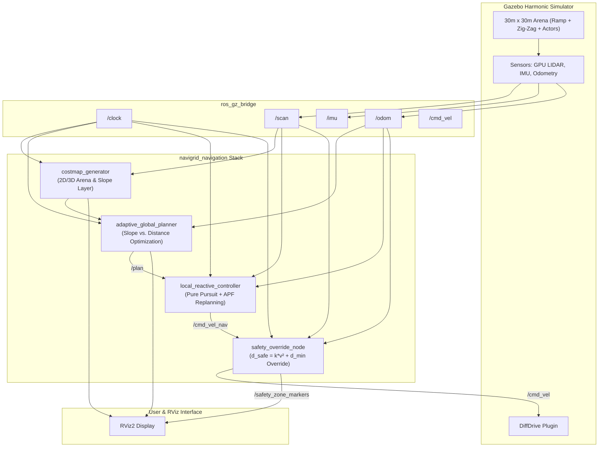

# NaviGrid AMR System Architecture & Technical Specifications

This document outlines the software and robotic system architecture for **NaviGrid: The Adaptive Path Challenge**, designed in accordance with the official competition rulebook and technical specifications.

---

## 1. System Overview & Node Interaction



---

## 2. Coordinate Transforms (TF Tree)

```
odom
 └── base_footprint (ground projection)
      └── base_link (chassis center of mass)
           ├── lidar_link (x: 0.18m, z: 0.245m)
           ├── imu_link (z: 0.22m)
           ├── left_wheel_link (y: +0.24m)
           ├── right_wheel_link (y: -0.24m)
           ├── front_caster_link (x: +0.22m)
           └── rear_caster_link (x: -0.22m)
```

---

## 3. Mathematical Formulations

### 3.1 Stage 2: Cost-Aware Global Path Selection
The global planner balances travel distance against elevation/slope terrain cost:

```text
J(path) = integral from 0 to L of (1 + alpha(payload) * S(s)) ds
```

Where:
* `L` is the Euclidean arc length of the candidate trajectory.
* `S(s)` is the slope/inclination penalty factor along path segment `s`.
* `alpha(payload) = alpha_0 * (m_payload / m_nominal)` dynamically scales the inclination penalty based on robot payload.
* **Direct Ramp**: `L ≈ 34m`, but incurs high slope cost (`S(s) > 0`).
* **Zig-Zag Corridor**: `L ≈ 55m`, but `S(s) = 0` (completely flat ground floor).

When payload exceeds the threshold `m_limit`, the direct ramp becomes impermissible and the planner autonomously routes through the zig-zag corridor.

### 3.2 Stage 3: Speed-Dependent Safety Envelope
The high-priority emergency stop node evaluates dynamic obstacle proximity against the kinetic braking threshold:

```text
d_safe = k * v² + d_min
```

#### Physical Derivation:
From kinematics, braking distance under constant maximum deceleration `a_brake` is:

```text
d_brake = v² / (2 * a_brake)
```

Defining `k = 1 / (2 * a_brake)` and adding sensor latency / chassis buffer `d_min` gives the safety envelope formula:
* At `v = 0.0 m/s`: `d_safe = d_min = 0.65m`.
* At `v = 0.8 m/s` (`k = 1.25`): `d_safe = 1.25 * (0.8)² + 0.65 = 1.45m`.

If an obstacle enters this zone, the node preempts `/cmd_vel_nav` and commands `v = 0` instantly.
